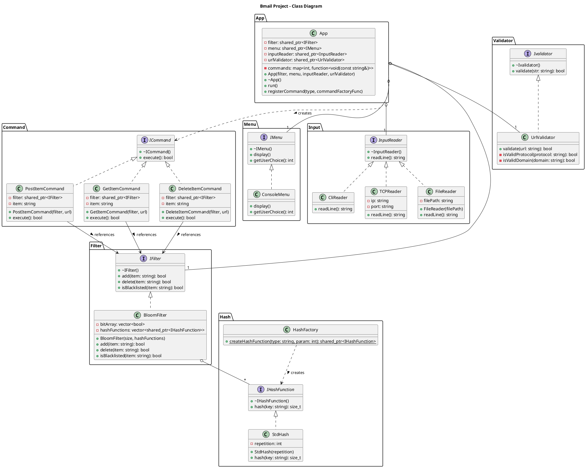

# Bmail

> **Note:** The first part of this project can be found at https://github.com/Binja12/Bmail/tree/part1

This project implements a console application demonstrating the use of a Bloom filter.
Users can add urls to the filter and query whether a url has been blocked.

It utilizes Docker for building and running both the main application and the unit tests, ensuring a consistent environment.

## Demo


## Getting Started

### Cloning the Repository

```bash
# Using HTTPS
git clone https://github.com/binja12/bmail.git
cd bmail

# OR using SSH
git clone git@github.com:binja12/bmail.git
cd bmail
```

## Usage

### Linux Instructions

#### Running the Application

```bash
docker compose down tcp-server
docker compose up --detach --pull always --remove-orphans --build tcp-server
docker compose run --pull always --remove-orphans --rm tcp-client
```

The application preserves the Bloom filter state between runs. If you want to start with a fresh Bloom filter, delete the data file:
```bash
rm data/bloomFilter.txt
```

#### Running the Unit Tests

```bash
docker build --tag bmail-tests --file Dockerfile.tests . &&
    docker run --rm --volume "$PWD":/app --workdir /app bmail-tests bash -c "
mkdir -p build/tests && \
cd build/tests && \
cmake ../../tests && \
make && \
./runTests"
```

### Windows Instructions

#### Running the Application

```powershell
docker compose down tcp-server
docker compose up --detach --pull always --remove-orphans --build tcp-server
docker compose run --pull always --remove-orphans --rm tcp-client
```
The application preserves the Bloom filter state between runs. If you want to start with a fresh Bloom filter, delete the data file:
```bash
rm data/bloomFilter.txt
```

#### Running the Unit Tests

```powershell
docker build --tag bmail-tests --file Dockerfile.tests .
docker run --rm --volume "${PWD}:/app" --workdir /app bmail-tests bash -c "mkdir -p build/tests && cd build/tests && cmake ../../tests && make && ./runTests"
```

## UML Diagram

The UML diagram for the project structure:



The source PlantUML code for this diagram is available in [assets/bmail-uml-diagram.puml](assets/bmail-uml-diagram.puml).

### Creating the UML Diagram

To regenerate the diagram:

```bash
# Install PlantUML
sudo apt install plantuml

# Generate the diagram
plantuml assets/bmail-uml-diagram.puml
```