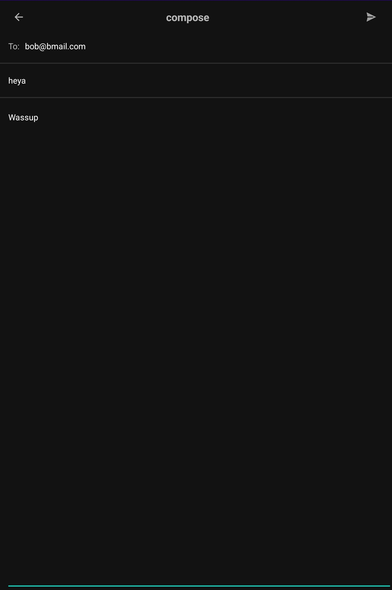

# 📱 Android Client Screenshots

This page showcases the main screens and features of the Bmail Android client.
Each screenshot is accompanied by a brief description.

---

## Registration Screen
_Description: The registration screen allows new users to create a Bmail account._

---

## Login Screen
_Description: The login screen allows users to sign in to their Bmail account._

---

## Compose Screen
_Description: The compose mail page allows users to create and send a new email._

---

## Main Screen
_Description: The main page displays the user's inbox with a list of emails and _

## Main Screen navigation drawer
_Description: The main navigation bar allows users to switch between different sections of the app._

---
## Mail Content Screen
_Description: The mail details page shows the content of a selected email._

---

## Profile Screen
_Description: The profile page displays the user's account information and allows updates._

---
