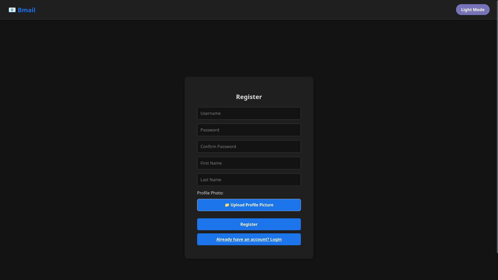
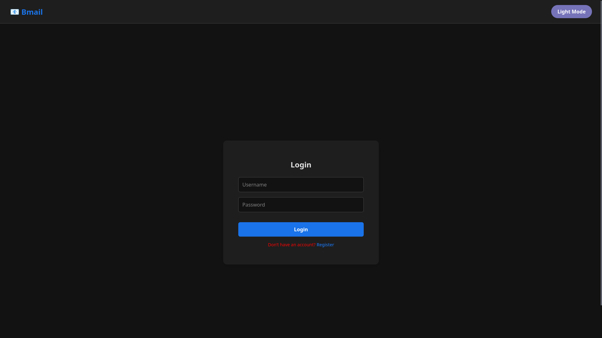
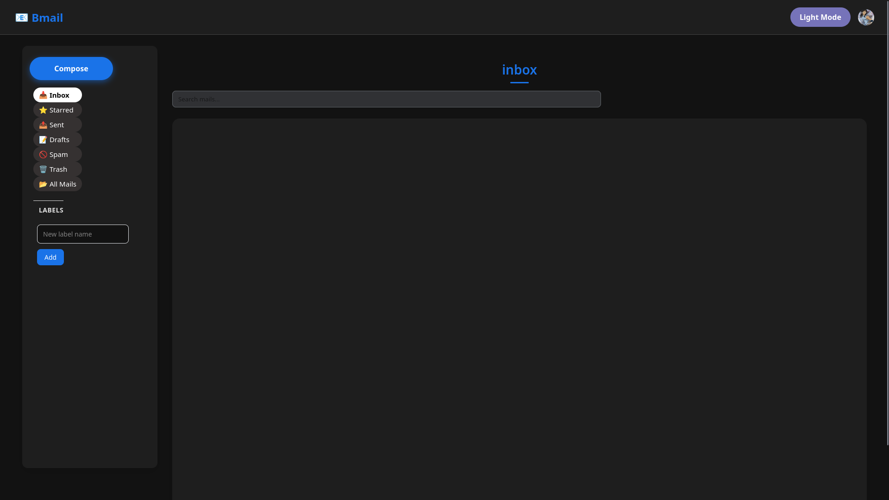
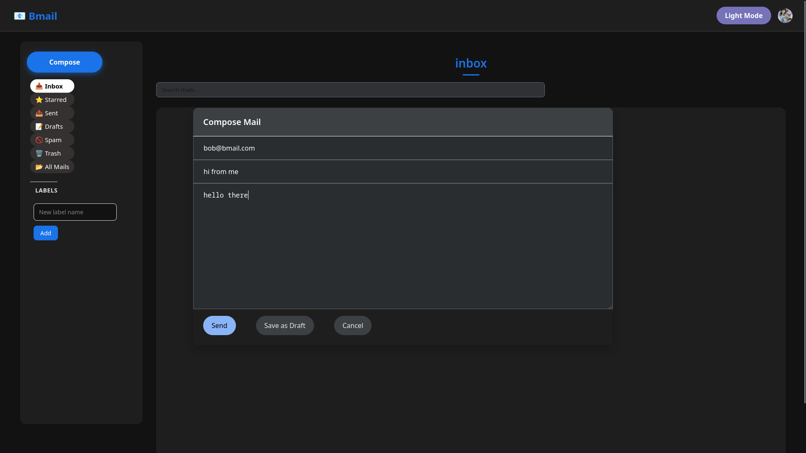
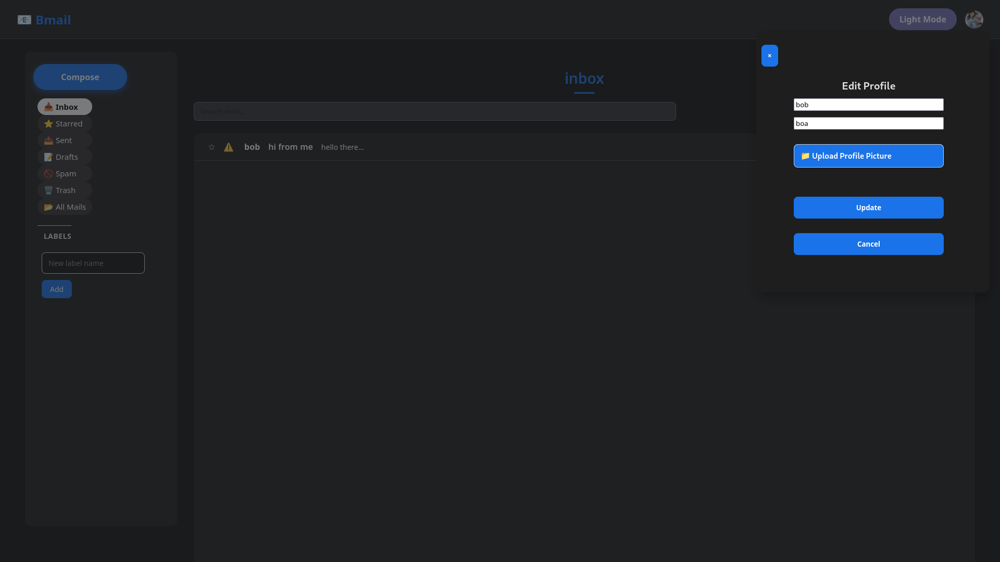

# 🖥️ Web Client Screenshots
This page showcases the main screens and features of the Bmail web client.
Each screenshot is accompanied by a brief description.

---

## Registration Page
_Description: The registration page allows new users to create a Bmail account._

---

## Login Page
_Description: The login page allows users to sign in to their Bmail account._

---

## Main Page
_Description: The main page displays the user's inbox with a list of emails and _

---

## Compose Mail
_Description: The compose mail page allows users to create and send a new email._

---

## Mail Details
_Description: The mail details page shows the content of a selected email._

---

## Update Profile
_Description: The update profile page allows users to change their account information._

---
