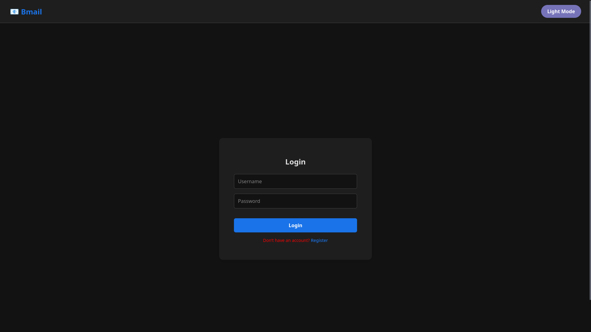
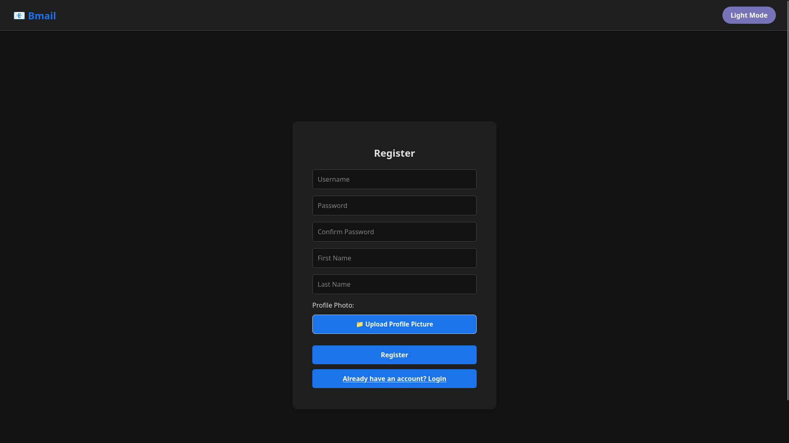
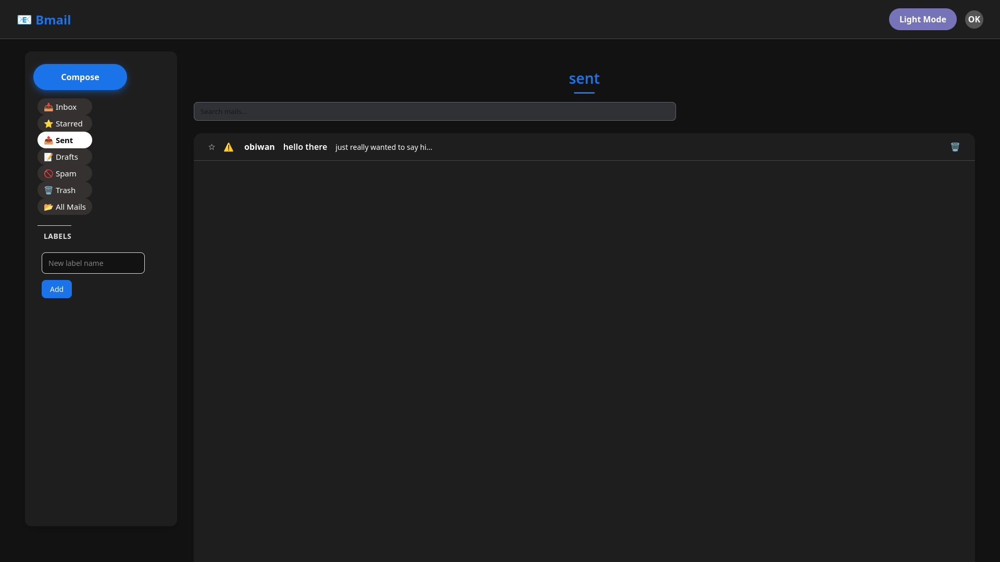
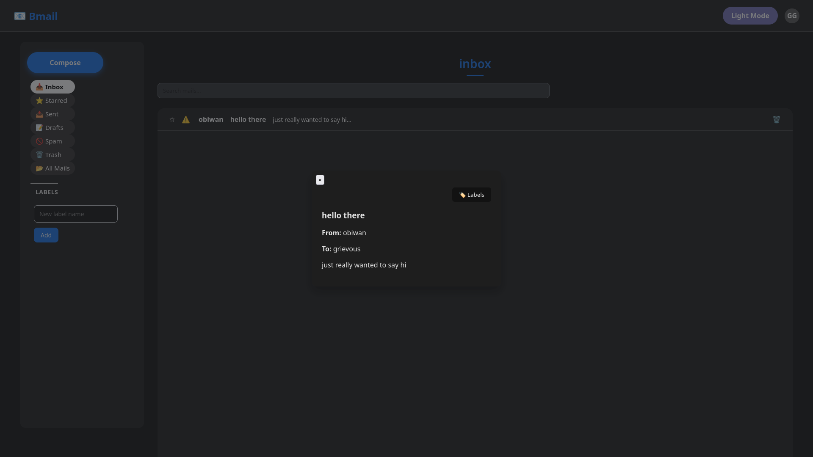

# 🖥️ Web Client Screenshots
This page showcases the main screens and features of the Bmail web client.
Each screenshot is accompanied by a brief description.

---

## Login Page
_Description: The login page allows users to sign in to their Bmail account._

---

## Registration Page
_Description: The registration page allows new users to create a Bmail account._

---

